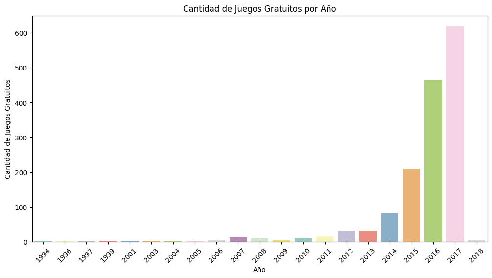
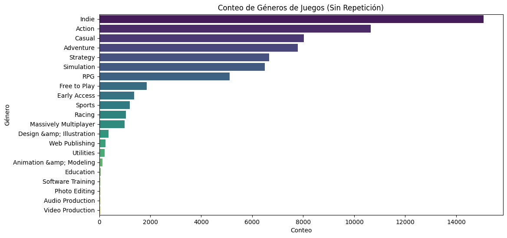
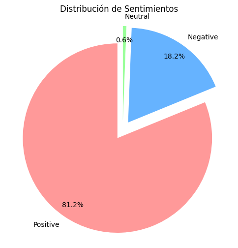

# ProyectoMLOPS

Machine Learning Operations (MLOps)

# Proyecto de Análisis y Predicción de Precios de Juegos de Steam

Este proyecto tiene como objetivo realizar un análisis completo de un dataset de juegos de la plataforma Steam, incluyendo un proceso de ETL, la creación de una API utilizando FastAPI y la implementación de un modelo de recomendacion basado una relación ítem-ítem, por lo tanto se elige un juego y en base a que tan similar es ese ítem al resto, se recomiendan similares.

## Funcionalidades

El proyecto consta de las siguientes funcionalidades principales:

1. **ETL Inicial**: Se realiza una transformación de datos (ETL) en el dataset de juegos de Steam para prepararlo para su análisis posterior.

2. **API con FastAPI**: Se implementa una API web utilizando FastAPI que permite acceder a seis funciones relacionadas con el análisis de los juegos y una septima para el sistema de recomendacion.

3. **Análisis Exploratorio de Datos (EDA)**: Se lleva a cabo un análisis exploratorio de datos, del cual se obtienen conclusiones clave que se presentan en forma de gráficos.

4. **Modelo de Machine Learning**: Se crea un modelo de recomendacion aplicando la similitud de coseno.

## EDA

Podemos ver en el siguiente grafico que la cantidad de juegos gratuitos en la plataforma Steam aumenta considerablemente de año a año. Ademas podemos ver que el salto principal de cantidad se da entre 2015 y 2016, siendo en 2015 aproxidamente 200 y en 2016 casi llegando a 500.

Podemos ver en el siguiente grafico que de la totalidad de juegos, los generos mas repetidos son los de Indie, Accion, Casual y Aventura. Ademas vemos que la cantidad de juegos Indie supera por casi el doble al tercer puesto del ranking (Casual).

Podemos ver en el siguiente grafico de torta la distribucion del analisis de sentimiento. Siendo casi irrelevantes la cantidad de sentimientos Neutrales con solo un 0.6% del total. Vemos por otro lado un 18.2% de sentimientos Negativos y superando por mucho a las anteriores categorias encontramos con un 81.2% juegos con un sentimiento positivo. Un numero bastante bueno teniendo en cuenta la cantidad de juegos que se lanzan todos los años.

## Consideraciones

Para realizar la limpieza desde 0 se deben descomprimir los archivos de archivos_sin_limpiar.zip. Tuve que comprimirlos porque los json originales eran muy pesados para GitHub.
Hubo una enorme limpieza de datos ya que existian alrededor de 80000 filas nulas.
Para el Modelo de recomendacion se recortaron a 15000 la cantidad de datos en el dataframe principalmente porque render no permite utilizar mas de 512MB. Siendo que mi dataframe completo es de mas de 20000 filas pueden haber errores o valores faltantes a la hora de buscar un Id.

La API cuenta con 6 endpoints:
* Genero( Año: str ): Se ingresa un año y devuelve un diccionario de clave Año con los 5 géneros más ofrecidos en el orden correspondiente como valor.
* Juegos( Año: str ): Se ingresa un año y devuelve un diccionario de clave Año con una lista de los juegos lanzados en el año como valor.
* Specs( Año: str ): Se ingresa un año y devuelve un diccionario de clave Año con los 5 specs que más se repiten en el mismo en el orden correspondiente como valor.
* Earlyacces( Año: str ): Diccionario con la cantidad de juegos lanzados en un año con early access. Siendo Año la clave y la cantidad el valor.
* Sentiment( Año: str ): Según el año de lanzamiento, se devuelve un diccionario, de clave sentimiento y de valor la cantidad de registros asociados a ese Sentimiento (Positive: 200, Negative: 100).
* Metascore( Año: str ): Top 5 juegos según año con mayor metascore Siendo un diccionario de clave el nombre del juego y de valor el metascore.

Los parametros requeridos para hacer funcionar la prediccion del modelo mediante FastAPI son:

1. Publisher. En formato string el nombre de la empresa que publica el juego (Ubisoft, Epic Games, Valve)

2. Tag. En formato string el tipo de juego. (Action, Adventure, Indie, Simulator)

3. Sentiment. En formato string el sentimiento general del juego siguiendo las siguientes consideraciones:
* Overwhelmingly Positive
* Very Positive
* Positive
* Mostly Positive
* Mixed
* Mostly Negative
* Negative
* Very Negative
* Overwhelmingly Negative.
* No data

4. Anio. En formato string el anio de salida el juego (2016, 2017, 2018)

## Instalación y Uso

1. Clona este repositorio: `git clone https://github.com/FabianGonzalezz/ProyectoMLOPS14`
2. Instala las dependencias: `pip install -r requirements.txt`
3. Ejecuta la API con FastAPI: `uvicorn main:app --reload`

Si tienes preguntas o comentarios, puedes contactarme en [Gmail](mailto:fabiann.m.gonzalez@gmail.com) o a través de mi perfil de GitHub: [Github](https://github.com/FabianGonzalezz/).
